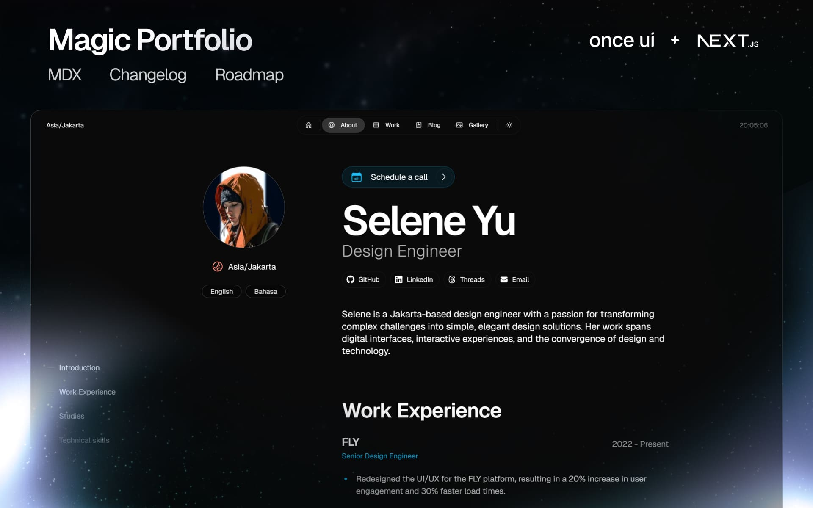

# Akash Tyagi's Portfolio

A modern, responsive portfolio website showcasing my work as a Backend Engineer.



## Getting started

**1. Install dependencies**
```
npm install
```

**2. Run dev server**
```
npm run dev
```

**3. Edit configuration**
```
src/resources/once-ui.config.js
```

**4. Edit content**
```
src/resources/content.js
```

**5. Create blog posts / projects**
```
Add a new .mdx file to src/app/blog/posts or src/app/work/projects
```

Built with Next.js. Requires Node.js v18.17+.

## Features

- **Responsive Design**: Optimized for all screen sizes
- **MDX Support**: Write blog posts and project pages in MDX format
- **SEO Optimized**: Automatic open-graph image generation
- **Dark/Light Mode**: Built-in theme switching
- **Fast Performance**: Optimized for speed and Core Web Vitals

## Contact

- **Email**: akashttyagi21@gmail.com
- **LinkedIn**: [akashtyagi21](https://www.linkedin.com/in/akashtyagi21/)
- **GitHub**: [whoakashtyagi](https://github.com/whoakashtyagi)

## License

All rights reserved © 2026 Akash Tyagi

## Deploy

This portfolio is deployed and can be easily hosted on Vercel, Netlify, or any Next.js-compatible platform.